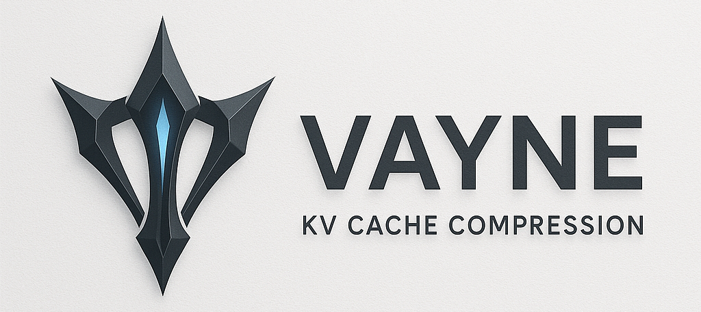

# Vayne: Lightning-Fast KV Cache Compression



## Overview

**Vayne** is a **lightweight**, **plugin-friendly**, and **extremely fast** KV cache compression framework designed for modern transformer-based language models.

Inspired by the League of Legends champion **Vayne**, this project shares her signature traits: speed, precision, and efficiency. Vayne surgically compresses the key-value (KV) cache used during transformer inference to drastically reduce memory footprint while maintaining minimal impact on performance.

---

## ✨ Key Features

- ⚡ **Ultra-Fast Compression**: Designed for runtime inference, optimized for minimal latency.
- 🧩 **Plugin Architecture**: Easily extendable with custom compression strategies.
- 🪶 **Lightweight**: Minimal dependencies, negligible memory overhead.
- 🧠 **Intelligent Precision Control**: Supports bit-level quantization (e.g., 2-bit, 4-bit, 8-bit) for keys and values separately.
- 🔄 **De-RoPE Integration**: Optional rotary positional embedding reversal for better quantization alignment.
- 🧪 **Outlier-Aware**: First-token preservation and adaptive scaling to handle value outliers.

---

## 🧱 Built on kvpress

This project is built on top of [`kvpress`](https://github.com/NVIDIA/kvpress), and is **based on commit [`4e559d3`](https://github.com/NVIDIA/kvpress/commit/4e559d357020082a08d08dde5f3a14187a30e86d)** of version `0.2.8`.  
Modifications include additional compression strategies and structural changes to support plugin-based extensions.

---

## 🔧 Installation

```bash
git clone https://github.com/boyuanzhang62/vayne.git
cd vayne
poetry install --with dev